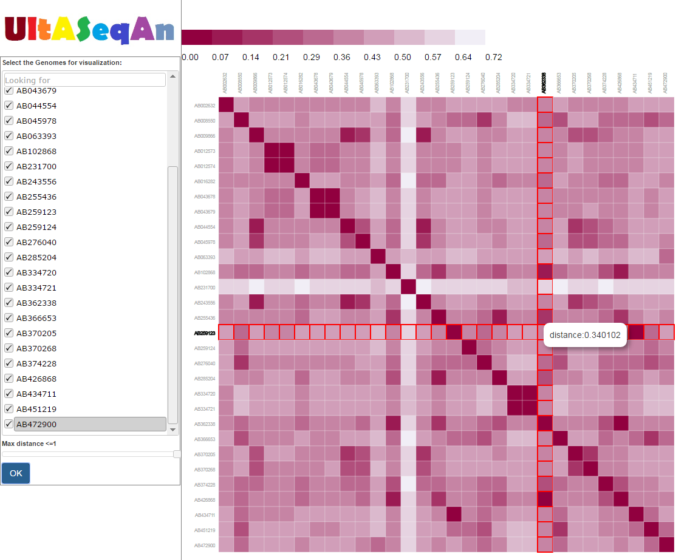

# UltASeqAn
Ultra-fast Alignment-Free Sequence Analysis

===================

Thank you for downloading this tool for sequence distance/dissimialrity measures using state-of-art Alignment-Free methods. This software provides the well-optimized programs to compute measures including Euclidian distance (Eu), Manhattan distance (Ma), Chebyshev distance (Ch), Jensen-Shannon divergence (JS), d2 dissimilarity, d2\* dissimilarity, d2S dissimilarity, Hao dissimilarity (CVtree). Please refer to the paper for the detailed definitions. The output of UltASeqAn can be simply pairwise distance matrix. UltASeqAn can also project the distance matrix to a two-dimensional space using principal coordinate analysis (PCoA). Alternatively, UltASeqAn uses neighbour-joining algorithm to cluster the distance matrix into phylogenetic tree in Newick format or convert the distance matrix as network in Cytoscape format. Finally, UltASeqAn provides user-friendly visualization of pairwise distances in terms of heatmap. 


----------

Compatibility
-------------

The software is written in c++, which has been fully tested under gcc version 4.8.1. It works under Linux or Mac environment. Precompiled executables are provided for these platforms, and users have the option to compile the source code for their specific platform if desired (see the Installation section below).

----------

Installation
-------------------

####<i class="icon-cog"> Compile program directly using g++

```sh
$ make
```

Usage
-------------------


> **Command:  ** ./UltASeqAn [options]* -D  < dist > -I < fa_files > -J < jfexe_path > -K  < intK >

> - Main arguments:
	- **-D** < dist >  Comma-separated list of distance measurements, the options include: D2-LongSeq, D2-NGS, D2star-LongSeq, D2star-NGS, D2shepp-LongSeq, D2shepp-NGS, L1, L2, LInf, Hao and JS. **E.g.** -D D2star-LongSeq,L1,Hao.
	- **-I** < fa_files > Comma-separated list of sequence fasta files, e.g. -I speciesA.fa,speciesB.fa,speciesC.fa. Pairwise similarity is calculated based upon the sequences specified with this option.
	- **-J** < jfexe_path > Use jellyfish to accelerate kmer counting. <jfexe_path> denotes the file path of jellyfish executable file, e.g. jellyfish-2.2.4/bin/./jellyfish
	- **-K** < intK > Kmer Length

> - Options:
	- **-L** < lower_count > Only consider k-mer with occurrence >= <lower_count>. The default value is 1.
	- **-M** < order > Markov Order involved in D2star-LongSeq, D2star-NGS, D2shepp-LongSeq, D2shepp-NGS and JS. There are two possible options. The first option is one single value indicating that all the sequences use the same order. The second option is comma-separated list of orders. Notice that the length of the list should match the number of fasta files. The order value could be non-negative integer but less than Kmer length or \"-1\" with the special intention to automatically infer the suitable order (not suitable for JS). The default Markov Order is 0 (i.i.d. model).
	- **-S** < dir > Save/Load calculated k-mer count binary files to the folder < dir >. Each input fasta file corresponds to particular model.
	- **-O** < path > Output results to file at < path >
	- **-T** < type > The output type as the input to downstream analysis, including: plain, [phylip](http://evolution.genetics.washington.edu/phylip.html) (as hierarchical clustering), [cytoscape](www.cytoscape.org/) (as network analysis) and mds (Multidimensional Scaling as 2D plotting). E.g. -T mds. The default type is plain.
	- **-V** < dir > Save visualization result to the folder <dir>

> - Examples:
	- ./UltASeqAn -M 0 -O output_path -S model_dir -T plain -I speciesA.fa,speciesB.fa -J /panfs/cmb-panasas2/ylu465/jellyfish-2.2.4/bin/./jellyfish -K 10 -D D2star-LongSeq,L1,Hao
	- ./UltASeqAn -M 1,A -S model_dir -I speciesA.fa,speciesB.fa -J /panfs/cmb-panasas2/ylu465/jellyfish-2.2.4/bin/./jellyfish -K 10 -D D2star-LongSeq,L1,Hao
	- ./UltASeqAn -M 0 -L 2 -I speciesA.fa,speciesB.fa -J /panfs/cmb-panasas2/ylu465/jellyfish-2.2.4/bin/./jellyfish -K 10 -D D2star-LongSeq,L1,Hao


A test example
-------------------

You can find a folder named "example" in the package, which contains 30 virus genomes. There are three subfolders, "data", "hash" and "visualization". The folder "data" contains 30 genome fasta files. The folder "hash" contains the corresponding binary kmer count files. The folder "visualization" contains the visualization-related files including web pages and associated javascript/css files.


Visualization
---------------

UltASeqAn provides a convenient way to visualize and analyze output result through browser. In particular, for each distance/dissimialrity measure, a corresponding webpage named '[measure Name]_k_[k]_main.html' will be generated under the output folder. The visualization mainly contains two parts: (1) select the interested genomes to manipulate from the left panel; (2) plot the distance heatmap between interested genomes in the right panel. Users can further look at detailed information by moving the mouse over the corresponding grid;

<p align="center">
  
</p>

----------


Contacts and bug reports
-------------------
Please send bug reports, comments, or questions to 

Yang Lu: [ylu465@usc.edu](mailto:ylu465@usc.edu)

Prof. Fengzhu Sun: [fsun@usc.edu](mailto:fsun@usc.edu)


----------

Copyright and License Information
-------------------


Copyright (C) 2016 University of Southern California, Yang Lu

Authors: Yang Lu

This program is free software: you can redistribute it and/or modify it under
the terms of the GNU General Public License as published by the Free Software
Foundation, either version 3 of the License, or (at your option) any later
version.

This program is distributed in the hope that it will be useful, but WITHOUT
ANY WARRANTY; without even the implied warranty of MERCHANTABILITY or FITNESS
FOR A PARTICULAR PURPOSE. See the GNU General Public License for more details.

You should have received a copy of the GNU General Public License along with
this program. If not, see http://www.gnu.org/licenses/.

Last update: 02-Oct-2016
